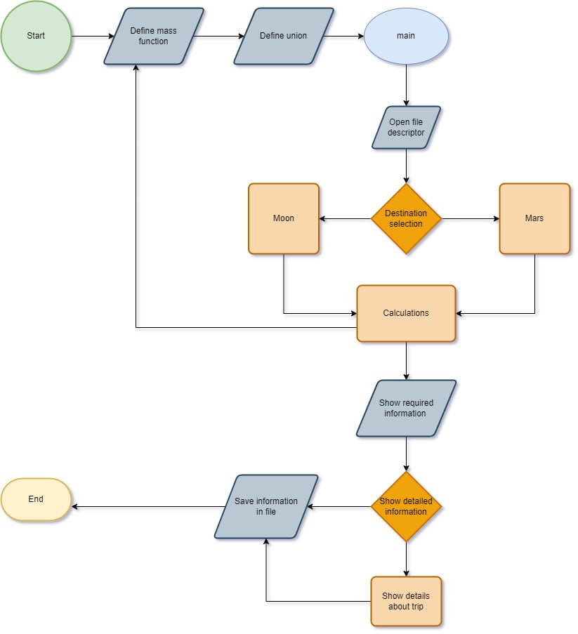

    # расхода на горивото и време за пътуване

    
    като исползва дани въведени от потребител:
        мястото на старта (cosmodrome)
        дистинацията (destinatioиn)
        даните за времето във съответната дистинация (взима се от интернет, съхранява се във файла и се използва от програмата)
        масата на товара (mass)